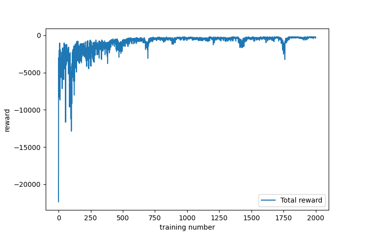

# REINFORCE Algorithm based on gym
***Author***: Shiwei Liu, [College of Artificial Intelligence, Nankai University](https://aien.nankai.edu.cn/)

***E-mail***: 2011832@mail.nankai.edu.cn

## About this program
This project is one of my assignments for the course "Reinforcement Learning" during my junior year at Nankai University. It is used to train a stable module used [REINFORCE](https://link.springer.com/content/pdf/10.1007/BF00992696.pdf) and solve some classic controlling problems such as inverted pendulum. I also used [gym](http://gym.openai.com/) to test the perfomance of the module.

## Requirements
1. Create a [conda](https://www.anaconda.com) environment by running this command(replace YOUR_ENV_NAME):
    ```
    conda create -n YOUR_ENV_NAME python==3.7 
    ```
    The python version **must be 3.7**.
2. Install CPU version [Pytorch](https://pytorch.org/):
    ```
    pip install torch 
    ```
    You also need to install gym which is the simulation environment of this program:
    ```
    pip install gym==0.22.0
    ```
    The version of gym **must be 0.22.0** otherwise this program will crash.
3. Use ```pip``` tool to install other required package:
    ```
    pip install numpy
    pip install pygame
    pip install matplotlib
    ```

## Run this program
1. Clone this project to your own PC:
    ```
    git clone https://github.com/SWL-SAMA/REINFORCE_Algorithm_based_on_gym.git
    ```
2. Activate the conda environment created before:
   ```
   conda activate YOUR_ENV_NAME
   ``` 
3. To train and test my REINFORCE program in MountainCar environment, you should entre that program fime:
   ```
   cd ./Mountain_car
   ```
   Train your own module by running:
   ```
   python Mountaincar_pg.py --run_mode=train --train_num=5000
   ```
   Test this module by running:
   ```
   python Mountaincar_pg.py --run_mode=test --train_num=0
   ```
4. To train and test my REINFORCE program in Cartpole environment, you should entre that program fime:
   ```
   cd ./Cartpole
   ```
   Train your own module by running:
   ```
   python Cartpole_pg.py --run_mode=train --train_num=5000
   ```
   Test this module by running:
   ```
   python Cartpole_pg.py --run_mode=test --train_num=0
   ```
## Results
1. After training 2000 times for MountainCar and 1000 times for Cartpole, it achieved great results:
<center class="half">
    
    
</center>

In training function I also plot the curve of rewards in MountainCar:

<center class="half">
    
</center>